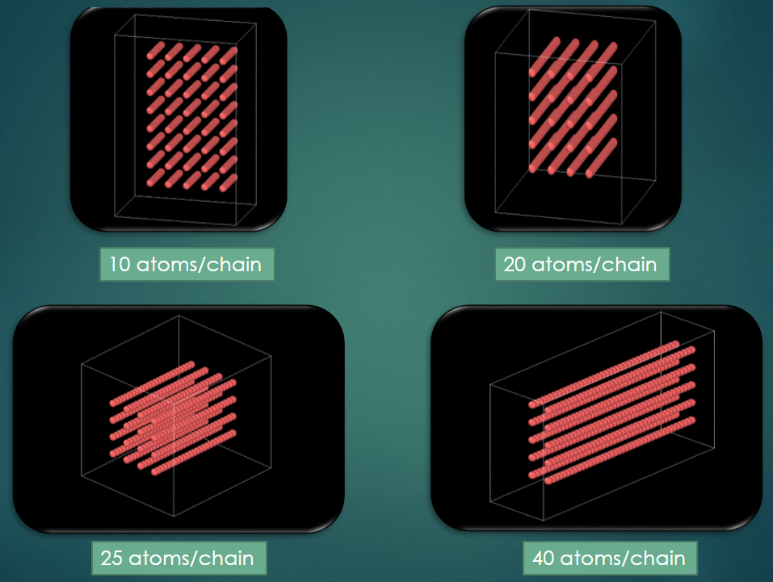

# Theta Solvent of Polymer using LAMMPS and Python

**Problem Statement:** To find $\theta$ solvent of a coarse-grained polymer under various conditions both internal, external.

**Tools used:** Python, LAMMPS, MATLAB, Git

A polymer can exists and display many sorts of complex nature when immersed in a liquid solvent. One that is studied in this
project, is the behaviour of a polymer similar to an ideal chain polymer. The conditions under which such behaviours are
observed is called the $\theta$ solvent of the polymer. A coarse grained polymer is used for this purpose.

In order to simulate the polymer we consider a box domain, inside which using the above **input_initial_state_python/**
code the polymer is initialized. The simulation of this polymer is now done using Large-scale Atomic/Molecular 
Massively Parallel Simulator(LAMMPS - Sandia National Laboratories). Since LAMMPS requires an input file in a certain
format for the initialization of the code, that can either be written manually, or generated via other means, I have
written the python script to generate the LAMMPS input file for the purpose.

On going through the repository, one can achieve the following,
* Input file for LAMMPS using the python script
* A comparative study with varying number of atoms per chain.
* Output files for Squared Radius of Gyration(of polymer) vs Temperature(T).
* Output files for Squared Radius of Gyration(of polymer) vs Damping Coefficient.

Below is a sample picture of the input state in a box domain, with varying atoms per chain,

## Contact
Feel free to contact me at:
joydeep.das39@gmail.com

## Portfolio
https://joydeepdascode.github.io/Joydeep

